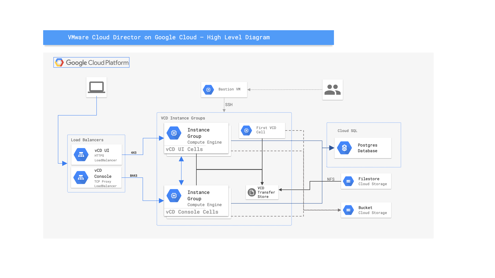

# VMware Cloud Director on Google Cloud - Terraform Modules

This project contains Terraform mudules that can be used to deploy VMware Cloud Director on Google Cloud.
The idea is for the deployed VCD instance to be able to connect and leverage vSphere resources from Google Compute VMware Engine.

## Features

The modules will create the following resources:
- A bucket in Google Storage to store the Cloud Director Binaries, Java Keystore and response.properties files.
- VPC Network, Cloud Router and Cloud NAT in the specified Region.
- Subnetwork with the specified CIDR block.
- The necessary firewall rules for the Cloud Dircetor Deployment to work.
- Filestore instance that will be mounter by the VCD cells for as a transfer store.
- Cloud SQL Postgres Instance for the VCD databease.
- Compute Engine Instances:
  - Bastion VM to access the VCD Cells thru it.
  - VCD Cells (minimum 2) to run the Cloud Director Services. The cels are separated in two Managed Insntace Groups, based on the function the execute - API/UI and Console Proxy.
- Two Load Balancers:
  - HTTPS loadbalancer ot provide acces to Cloud Director UI and API.
  - TCP Proxy loabalancer to provide access for Cloud Director Console proxy.

## Deployment diagram

**Figure 1.** *High Level Diagram*

## Inputs

| Name | Description | Type | Default | Required |
|------|-------------|------|---------|:--------:|
| gcloud_project | ID of the Google Cloud Project | `string` | `""` | yes |
| gcloud_region | Google Cloud Region | `string` | `""` | yes |
| gcloud_subnet_cidr | Subnet CIDR Bloock | `string` | `172.16.0.0/16` | no |
| sql_deletion_protection | Enable or Disable SQL DB Deleteion protection | `bool` | `false` | no |
| target_size_ui | The target number of instances for the VCD UI managed instance group | `number` | `1` | no |
| target_size_console | The target number of instances for the VCD Console managed instance group | `number` | `1` | no |
| vcd_binary_filename | The name of the VCD binary file located in the `files/vcd-binaries/` folder. | `string` | `""` | yes |
| vcd_keystore_filename | The name of the VCD Java Keystore file located in the `files/vcd-cert-file` folder, e.g. - `certificates.ks`. | `string` | `""` | yes |
| vcd_keystore_password | VCD Java Keystore file password | `string` | `""` | yes |
| lb_cert_filename | The name of the VCD UI HTTPS Loadbalancer certificate file located in `files/vcd-lb-cert/` folder, e.g. - `cert.crt`. | `string` | `""` | yes |
| lb_cert_key_filename | The name of the VCD UI HTTPS Loadbalancer certificate key file located in `files/vcd-lb-cert/` folder, e.g. - `cert.key`. | `string` | `""` | yes |
| vcd_admin_username | VCD Administrator username | `string` | `vcd_admin` | no |
| vcd_admin_password | VCD Administrator password | `string` | `""` | yes |
| vcd_admin_email | VCD Administrator Email Address | `string` | `vcd_admin@example.com` | no |
| vcd_system_name | VCD Instance Name | `string` | `""` | yes |
| vcd_serial_number | VCD Instance Serial Number | `string` | `""` | yes |

## Requirements

The modules 

### Local Files

- VMware Cloud Director Binary - Place the VCD binary `<vcd-binary-name>.bin` in `files/vcd-binaries` folder.
- VCD Java keystore files - Place the Java keystore files `<jave-keystore-filename>.ks` in `files/vcd-keystore-file` filder.
- HTTPS Load balancer certificate files - Place the HTTPS loadbalancer certificate `<cert-file>.crt` and key `<cert-key-file>.key` files in `files/vcd-lb-cert` folder.

### IAM permissions

### APIs
